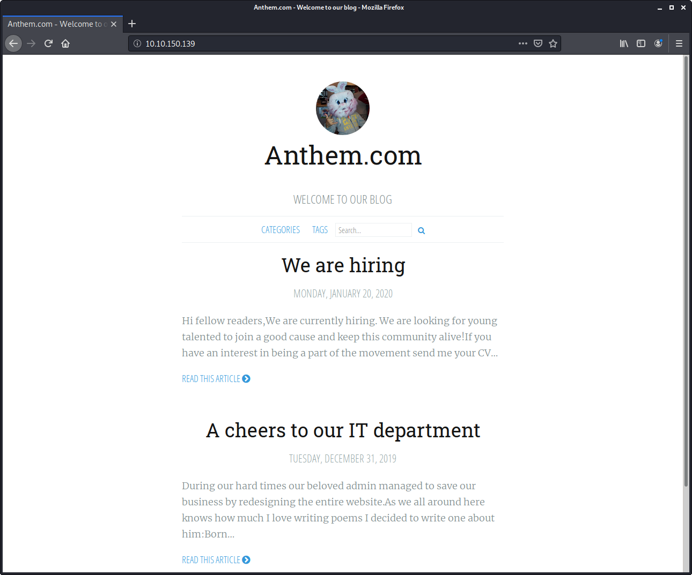
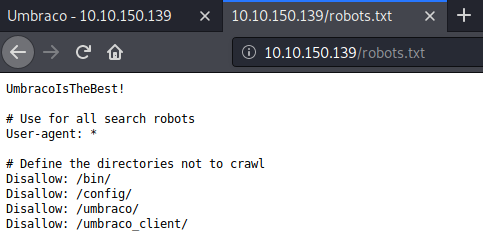
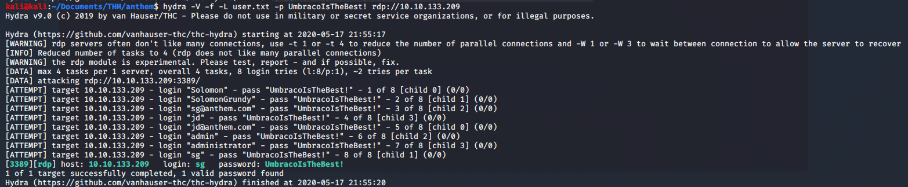
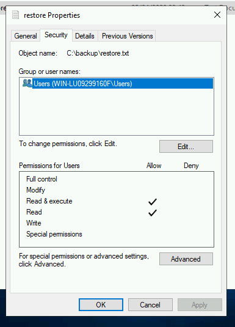

# Anthem

> Nashia Holloway | May 17th, 2020

## Enumeration

Port 80, SMB, and RDP are open.



Within robots.txt, there's a possible password: `UmbracoIsTheBest!`



There are some flags hidden in the metadata of the webpages. Googling the poem in one of the blog posts, we have the name of the admin: Solomon Grundy. Email: `sg@anthem.com`. They are using the Umbraco CMS, which has a login page at `http://IP/umbraco`.

## Initial Access

Now we have potential creds to login to an RDP session. I just don't know the username. I put all potential ones in a txt file and run hydra against it, with success.

```
hydra -V -f -L user.txt -p UmbracoIsTheBest! rdp://10.10.133.209
```



```
sg:UmbracoIsTheBest!
```

```
xfreerdp /u:'WIN-LU09299160F\sg' /v:10.10.133.209
```
## Privilege Escalation

The user flag is on the desktop. We need an admin password to access the root flag. It's in a hidden folder called "backup", but we don't have permission to view it. Changing the persmissions to add "USERS" allowes us to view it and gain access to the Administrator Desktop with the password.



