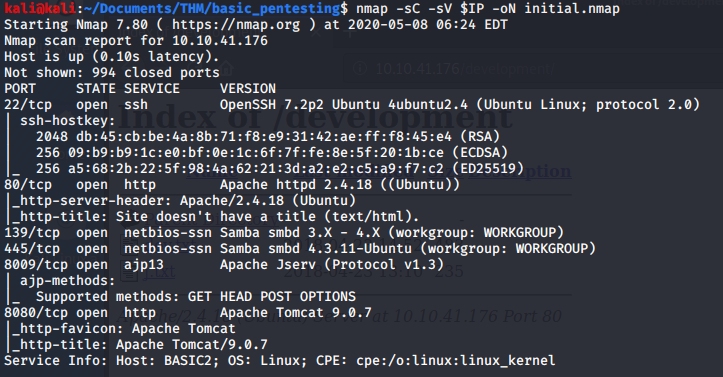
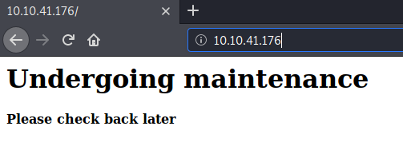
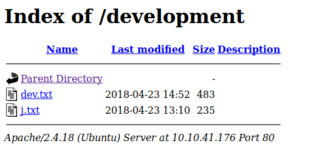
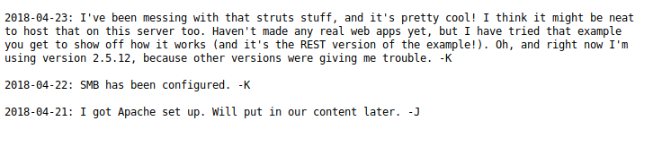
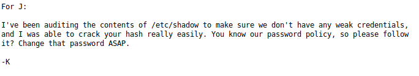
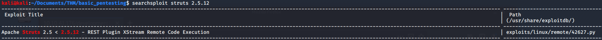
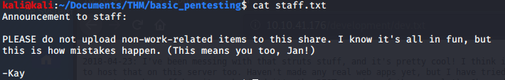
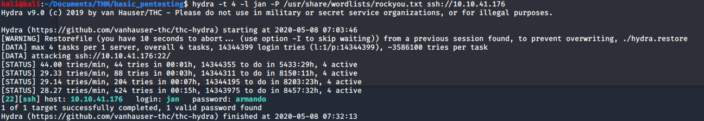
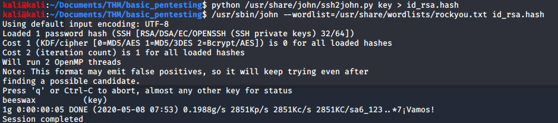
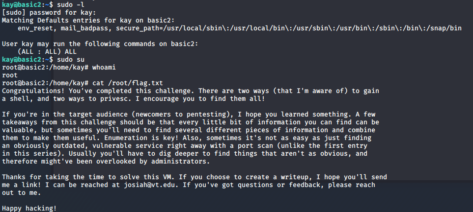

# Basic Pentesting

> Nashia Holloway | May 8th, 2020

## Task 1 Webapp Testing and Priv Esc

**3. What is the name of the hidden directory?**







There are further clues in the two files.





Looks like they're using Apache Struts with a REST plugin. They even give the version: `2.5.12`. Searching for an exploit, there is one.



There's a metasploit module available. It doesn't work. On to something else. SMB here we come!

There's an exploit available for the version of Samba running, but we need a share name to use. `nmap -p 445 --script=smb-enum-shares.nse,smb-enum-users.nse $IP -oN shares.nmap` shows there are 2 shares, anonymous and IPC$. Connecting to the anon share `smbclient //$IP/anonymous`, there is a `staff.txt` file. Also, the exploit still doesn't work.



Jan could be a potential user name. We can use Hydra to brute force. Let's try it for an SSH session.

```
hydra -t 4 -l jan -P /usr/share/wordlists/rockyou.txt ssh://10.10.41.176
```

After forever and a day (30 min), we get our password.



In the home directory, there's another user named Kay. There are more files in there. Using the hint, apart from a password, a user can access a machine with an ssh key. We can cat the `id_rsa` file and grab the private key for John to crack.

Copy the private key locally (named the file "key")

```
python /usr/share/john/ssh2john.py key > id_rsa.hash
/usr/sbin/john --wordlist=/usr/share/wordlists/rockyou.txt id_rsa.hash
```



Now that we have the password for the ssh public key, we can ssh from Jan to Kay.

```
ssh -i /home/kay/.ssh/id_rsa kay@10.10.41.176
```
Once logged in, `cat pass.bak` to get Kay's password. (We can also `sudo -l` with it to see what root privs we have. Turns out we have all the privs and can `sudo su` to get root and `cat /root/flag.txt`




