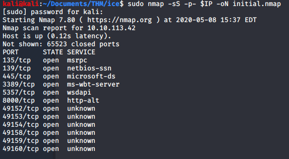
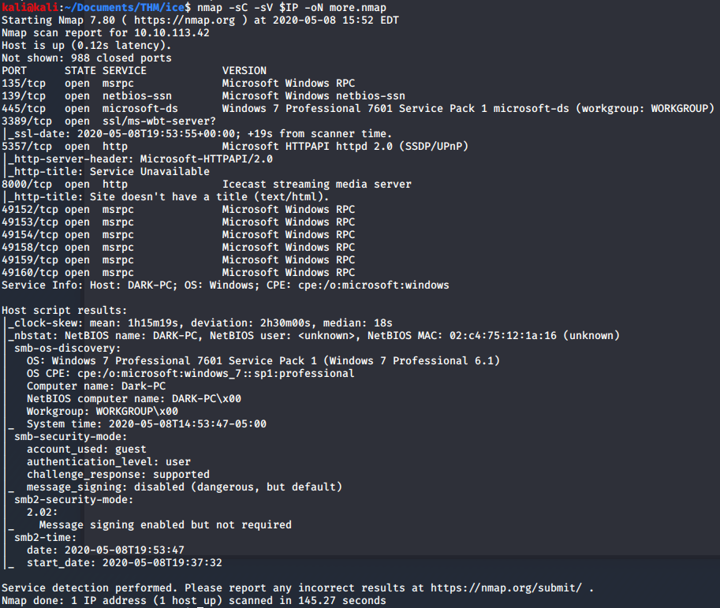
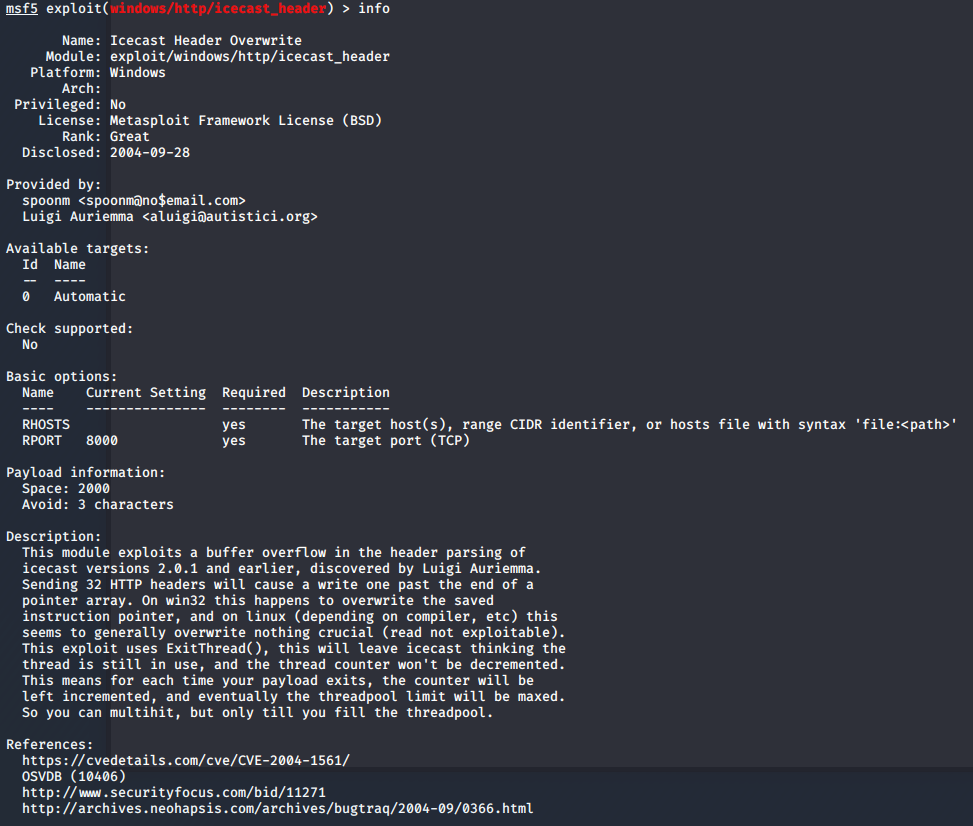
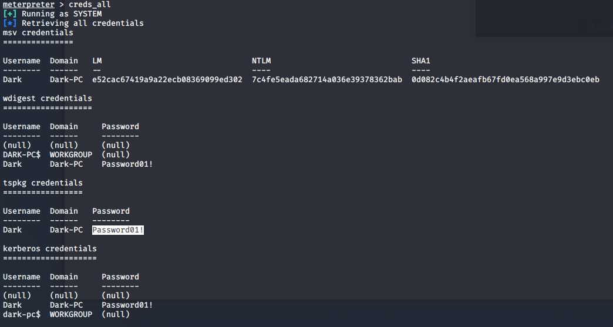

# Ice

> Nashia Holloway | May 8th, 2020

## Task 2 Recon

```
sudo nmap -sS -p- $IP -oN initial.nmap
```



We have RDP, SMB, Web Services on Devices (WSD) API, and http running on some ports. We need a little more info.

```
nmap -sC -sV $IP -oN more.nmap
```



We have an Icecast server running, which is a media server. 

## Task 3 Gain Access & Elevate Privs



Set the RHOSTS and run. We get a meterpreter shell as Dark. We can use `exploit/windows/local/bypassuac_eventvwr` after running `run post/multi/recon/local_exploit_suggester`. Out new shell is a Windows one, so we can run `whoami /privs` to see what user privileges we have.

A good one to have is `SeTakeOwnershipPrivilege` to take ownership of files and other objects (allowing us to migrate to another process).

## Task 3 Looting

We have to migrate to an x64 process first, before migrating to lsass.exe. After that, `load kiwi` to get mimikatz.

```
creds_all
```



