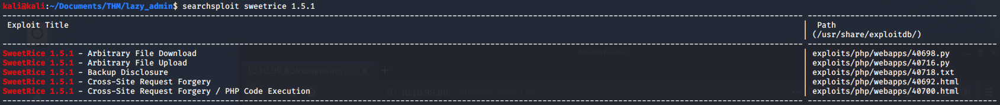

# Lazy Admin

> Nashia Holloway | May 7th, 2020

## Task 1 Lazy Admin

**1. What is the user flag?**

Nmap results show that only SSH and port 80 are open on this linux server. A gobuster search reveals the `/content` page, which tells us there is a CMS being used called SweetRice. A more detailed gobuster search on the content path reveals much more.

Looking at `/content/inc/` shows where PHP files are. And there is a login page under `/content/as`. Under `/content/inc`, we can find the version of the software being used in the `latest.txt` file. Searching exploit db for SweetRice 1.5.1 shows there are exploits available. Seems we need some creds though.

Looks like there's a potential way to get some creds.

Looking at said file, we find the username and password (MD5 needs to be cracked). `Manager:PAssword123`

Now that we have creds, we can try one of the exploits. I'll do the last one in the searchsploit list. It tells you where you can upload a php reverse shell withing the CMS.

Now we have a shell running as `www-data` and can get the user flag.

**2. What is the root flag?**

`sudo -l` to see what we can run as root. And there's a perl script we can run as root. Within that, there's a shell script being run. And within that, there's a reverse shell being run (interesting). We can edit this and get our own reverse shell.

By running the script with sudo privs and creating another listener on that port, we now have a root shell and can grab the root flag.
