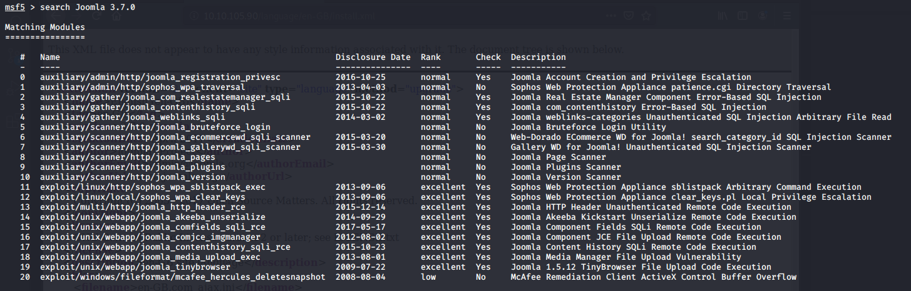
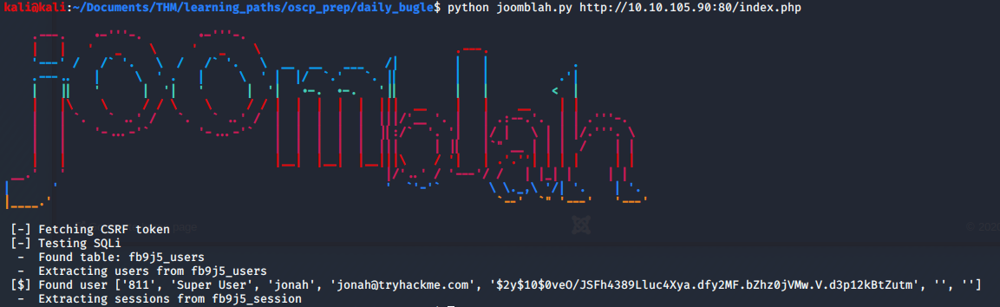
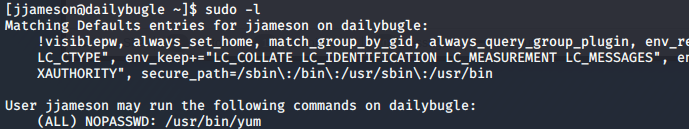

# Daily Bugle

> Nashia Holloway | May 3rd, 2020

## Task 1 Deploy

**1. Who robbed the bank?**

```
Spiderman
```

## Task 2 Obtain User and Root

**1. What is the Joomla version?**

```
http://10.10.105.90/language/en-GB/install.xml
```
Shows the version is `3.7.0`.

Searchsploit reveals there is an SQL Injection vulnerability.



**2. What is Jonah's cracked password?**

Use Joomblah.py to find the user and hashed password.



Crack password with hashcat. 

```
sed -n '45000,50000p' /usr/share/wordlists/rockyou.txt | hashcat -m3200 -a0 --force '$2y$10$0veO/JSFh4389Lluc4Xya.dfy2MF.bZhz0jVMw.V.d3p12kBtZutm'
```
password is `spiderman123`.

**3. What is the user flag?**

Login with the creds.

```
http://10.10.105.90/administrator/index.php?option=com_templates&view=template&id=506&file=aG9tZQ==
```

Takes us to a page where we can upload php. Uploaded reverse php shell to index.php and set up listener to get shell. Shell spawned as apache. `cat /var/www/html/configuration.php` for second set of creds. `jjameson:nv5uz9r3ZEDzVjNu`.

SSH into the machine with that username and password. Get the user flag.

**3. What is the root flag?**



The user can run yum with sudo privs. Searching [gtfobins for yum](https://gtfobins.github.io/gtfobins/yum/) we have an exploit. Running the code we get a root shell.
