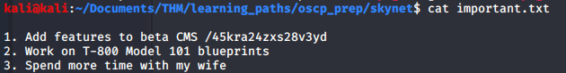

# Skynet

> Nashia Holloway | May 2nd, 2020

## Task 1 Deploy and Compromise

**1. What is Miles' password for his emails?**

Inital nmap:


enum4linux:


`smbclient //$IP/anonymous` to connect to the share. Go to the logs directory and `get log1.txt` to pull it locally. Cat it to find list of passwords.


```
gobuster dir -u http://10.10.26.76:80 -w /usr/share/wordlists/dirbuster/directory-list-2.3-medium.txt
```

Showed the squirrelmail url.

The first password in the `log1.txt` file can be used to login to the mail site with the milesdyson username. There is an email that has his changed password: ")s{A&2Z=F^n_E.B\`". We can try to login to his smb share with this.


**2. What is the hidden directory?**

Login to Miles' share.

```
sudo smbclient //$IP/milesdyson -U milesdyson
```

cd into notes and grab "important.txt". 



The hidden directory is found here.


**3. What is the user flag?**

```
gobuster dir -u http://10.10.26.76:80/45kra24zxs28v3yd/ -w /usr/share/wordlists/dirbuster/directory-list-2.3-medium.txt
```

We find an `administrator/` page and discover a Cuppa CMS is running.


There's only 1 exploit available for this CMS in exploitdb.

**4. What is the root flag?**
