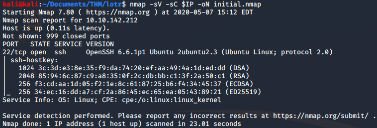
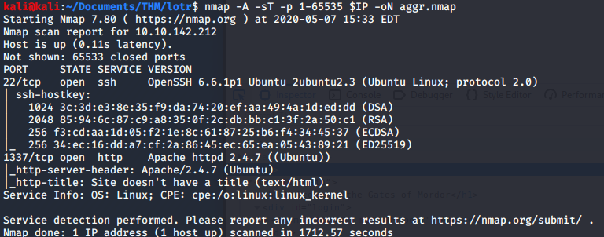
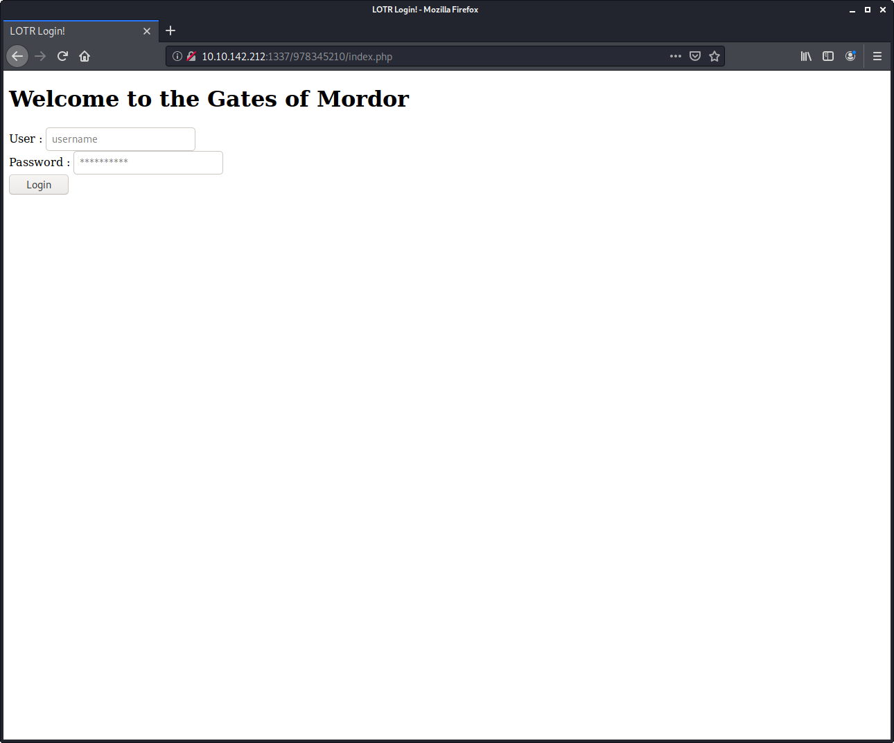
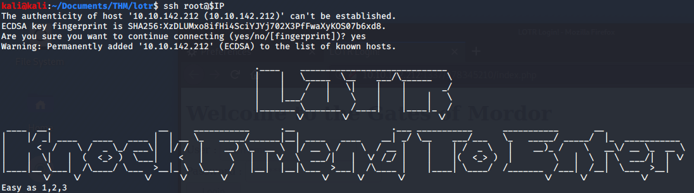

# Lord of The Root

> Nashia Holloway | May 8th, 2020

## Task 2 Root the Box

Only SSH is open. Let's try a more aggressive scan...

We can see port 1337 is open, running an apache web server. On the server's page, we're greeted with a photo. Nothing interesting in the source. I went to robots.txt, which didn't exist, resulting in a 404 not found, but there was another picture. Looking at the source code, there's a base64 encoded string. I had to decode it twice to get the hidden directory. Navigating to the directory shows a login page.

For the life of me, I couldn't get SQLmap to work right, so switching tactics for now.

Attempting to SSH into the box, there's a clue about port knocking with the sequence 1, 2, 3. This would have been helpful if I hadn't of already found the hidden service. But in the future, this is the command I would have run: `nmap -r -Pn -p1,2,3 $IP -oN knock.nmap`.

Going back to SQLMap, It's only returning the first 2 characters of the database "Webapp". Within there are usernames and passwords (Had to result to a writup for this). From there, we can SSH into the box with the smeagol username and password, and exploit a kernel flaw in the Ubuntu machine. (There's also a buffer overflow vuln in one of the programs).

I count this box as a fail since I couldn't get SQLMap to work.
