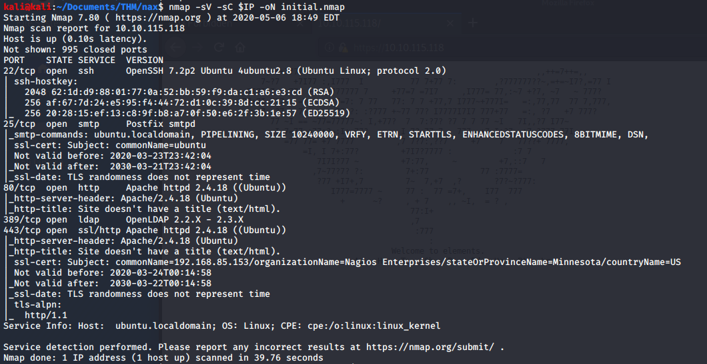
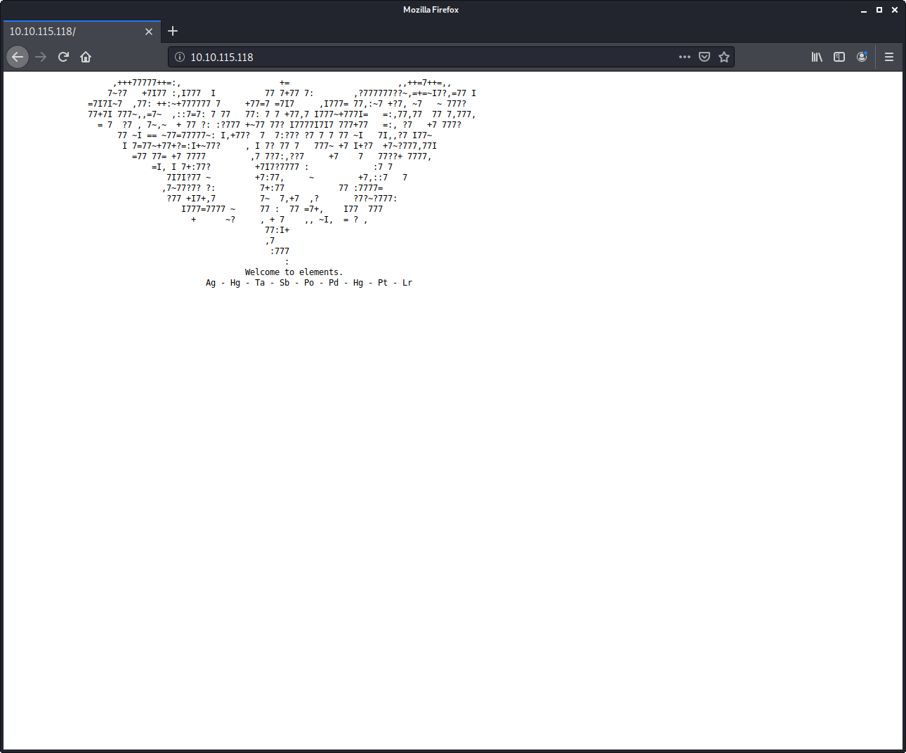
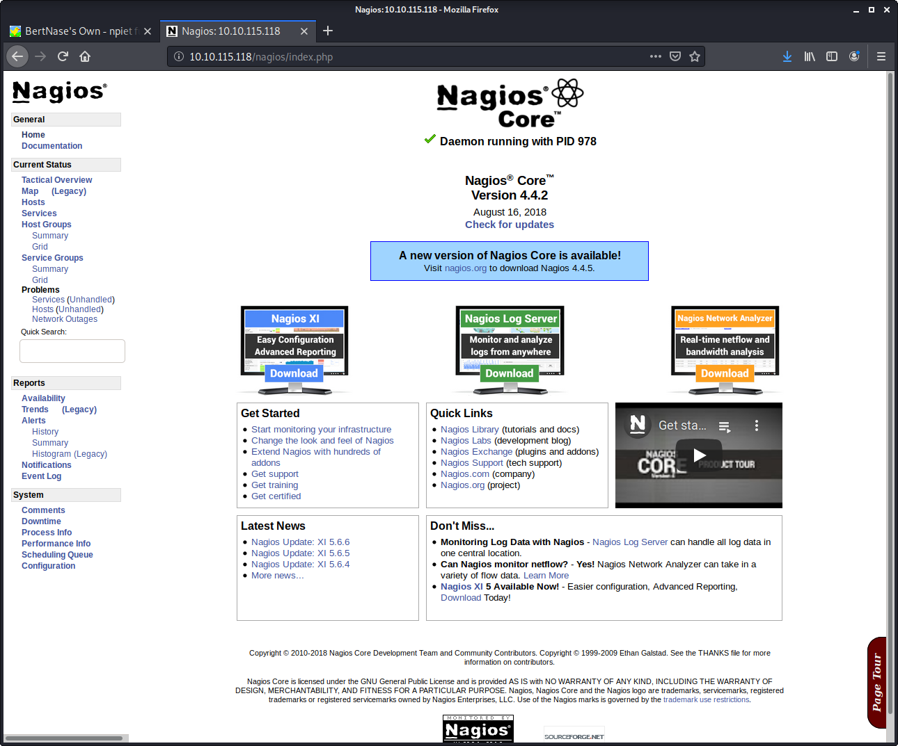

# Nax

> Nashia Holloway | May 6th, 2020

## Task 1 Flag

**1. What hidden file did you find?**

`gobuster dir -u http://10.10.115.118:80 -w /usr/share/wordlists/dirbuster/directory-list-2.3-medium.txt`

Shows that there's a directory called `/nagios`, which is an open source computer, network, and infrastructure monitoring software. Searching exploit db, there is a recent (2020) exploit available. There's an authentication prompt at this directory.

No luck there. It would be better if we find a password somewhere. Maybe there's another clue on the web page.

`Ag - Hg - Ta - Sb - Po - Pd - Hg - Pt - Lr`

`Silver (47) - Mercery (80) - Tantalum (73) - Antimony (51) - Polonium (84) - Palladium (46) - Mercury (80) - Platinum (78) - Lawrencium (103)`

`047 080 073 051 084 046 080 078 103` -> `/PI3T.PNg` **ASCII to text**

**2. Who is the creator of the file?**

[metapicz](metapicz.com) shows the creator of the image.

**3. What is the username you found?**

[Searching "piet decode"](https://www.bertnase.de/npiet/npiet-execute.php) gives a website to decode piet program images. With that, we get a username and password.

**4. What is the password you found?**

See above.

**5. What is the CVE number for this vulnerability**?

We can login to the nagios interface now. 

`CVE-2019-15949`

**7. What is the full path for the exploit module?**

`linux/http/nagios_xi_authenticated_rce`

Once exploited, we get a shell as root. The rest is easy.
