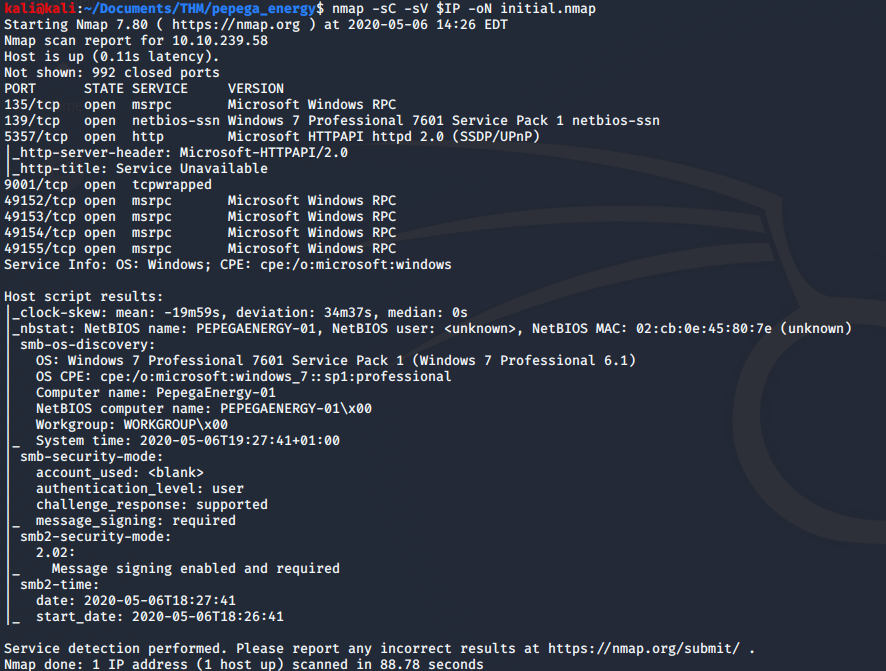
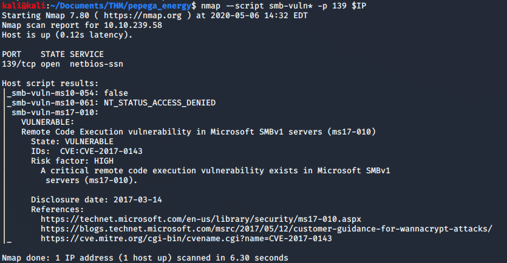
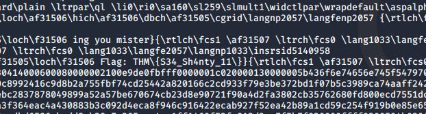
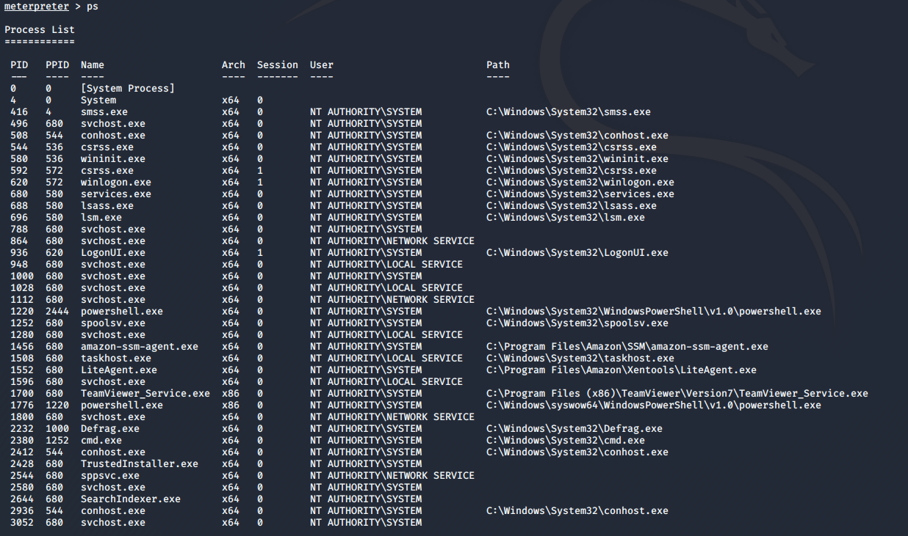
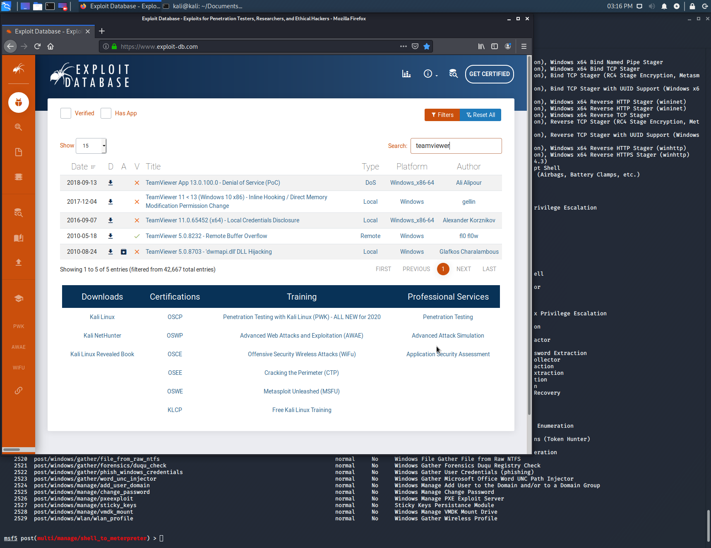
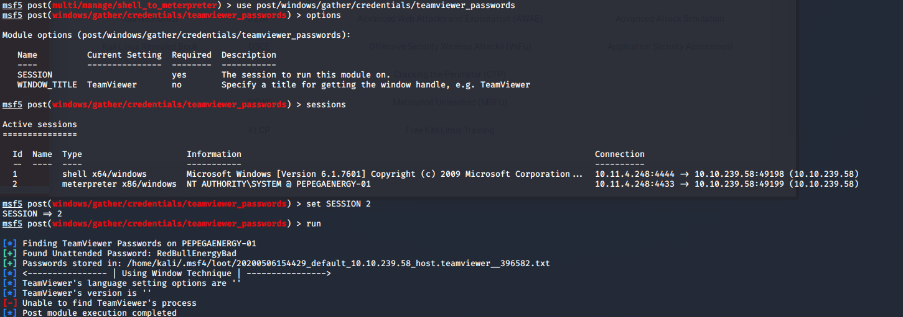
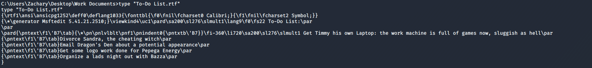

# Pepega Energy

> Nashia Holloway | MAy 6th, 2020

## Task 1 Rana Verde

**1. What flag can be found as the standard user?**

Port 445 doesn't show as open, but port 139 is, so we can see if it's vulnerable to EternalBlue (MS17-010).

Is is, so let's open msfconsole and try to get a shell with the `windows/smb/ms17_010_eternalblue` module.

Within the shell, navigating to `C:\Users\Timmy\Desktop` there is a `rune scape pass word.rtf` file that has the first flag in it.

**2. What flag can be found as the admin user?**

We can upgrade our shell session to meterpreter by using `post/multi/manage/shell_to_meterpreter`. Running `ps` in the meterpreter session shows there is a TeamViewer service running.

Searching Exploit DB, there is a "Local Credentials Disclosure" exploit available. Let's see if it'll work.

Doing some searching, there is a metasploit teamviewer passwords module, but my database wasn't up to date, so I had to do that first. 

Now that we have the password we can RDP into the host. The password doesn't work, so I'll try to grab it manually by seeing what it's doing in the script.

`reg query HKEY_LOCAL_MACHINE\SOFTWARE\TeamViewer\Version7 /v SecurityPasswordAES`. Once we have the REG_BINARY value, we can plug it into a python script I found online [here](https://kalilinuxtutorials.com/decryptteamviewer/). This gives us the full password (the one from metasploit is missing the last 2 characters).

`xfreerdp /u:'PEPEGAENERGY-01\Zachary' /v:10.10.239.58`

The rest of the questions can be found through the RDP session (Look at Firefox history too). If I've answered a question below, I found it before exploiting TeamViewer. (Also, I had to brute force the answer to question 3, because I couldn't find the answer anywhere within the environment).

**6. What did Zachary call his wife?**

Navigating to Zachary's desktop and taking a look in hist `Work Documents\To-Do List.rtf` file shows the answer to this.

**7. Where does Zachary's Graphic Designer Work?**

`type "Email Backup - Mockup.rtf"`

