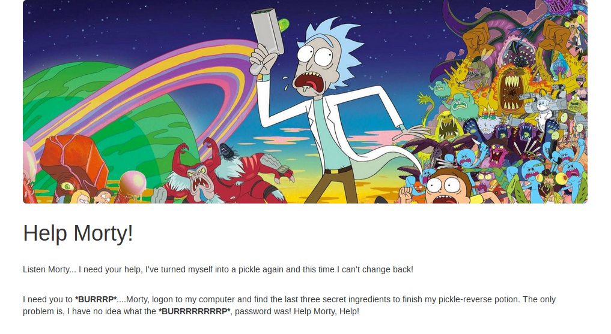
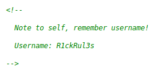
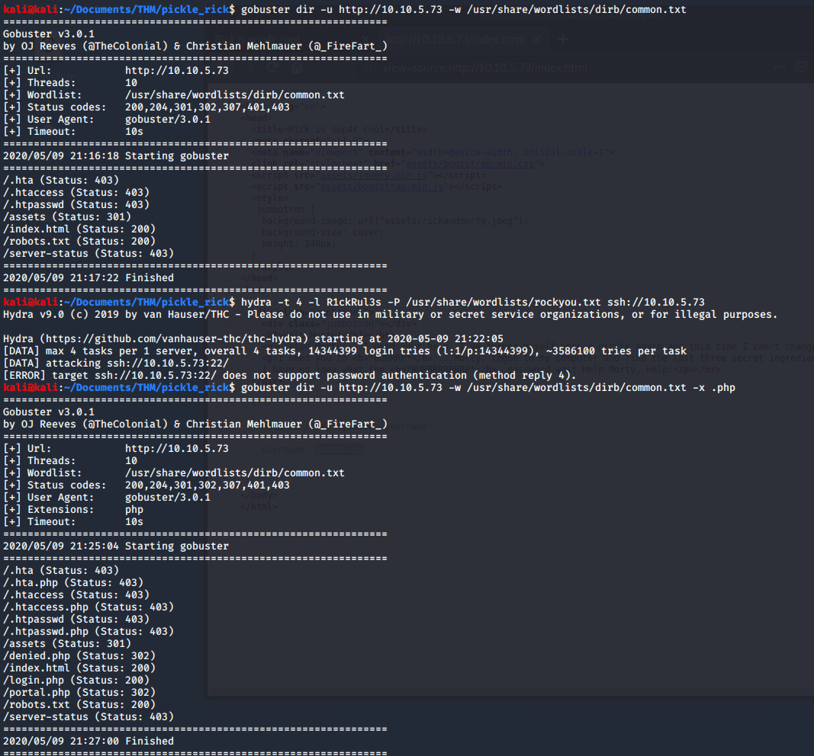
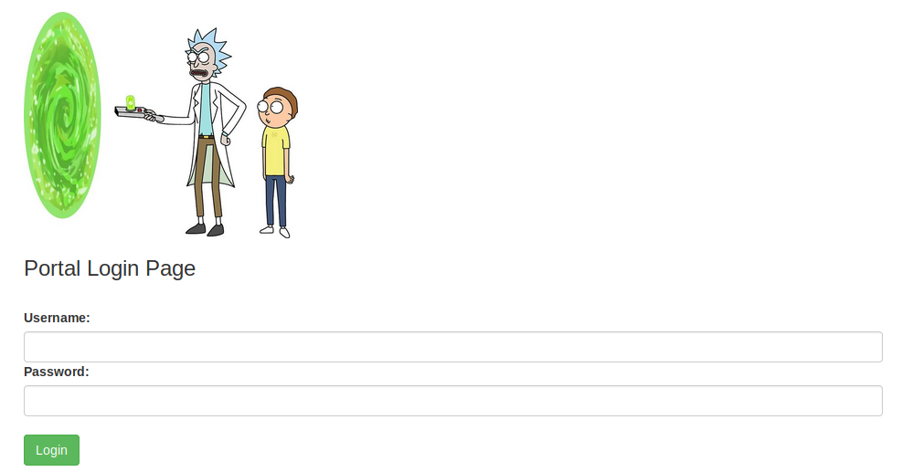
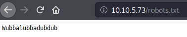
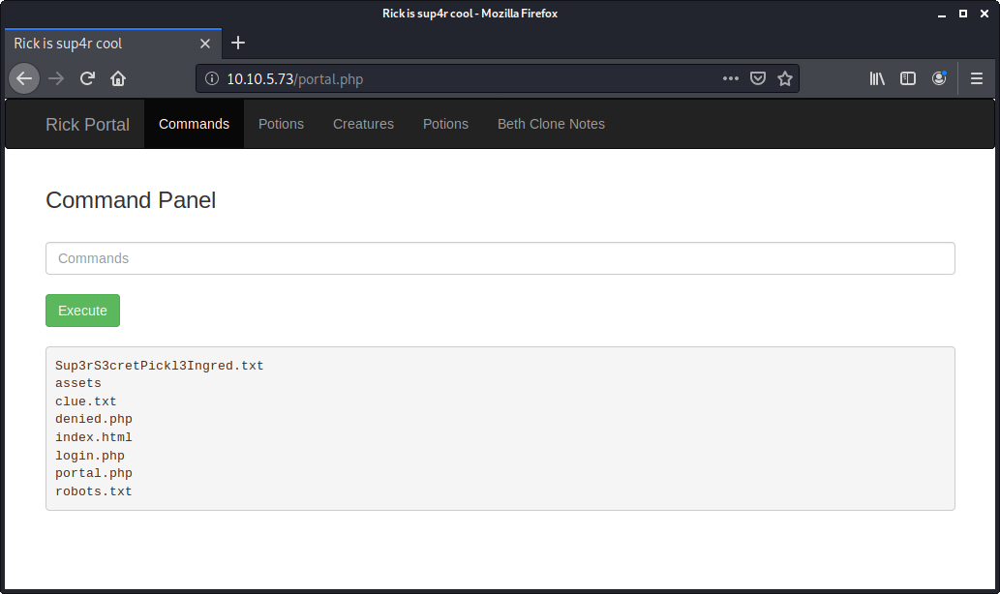
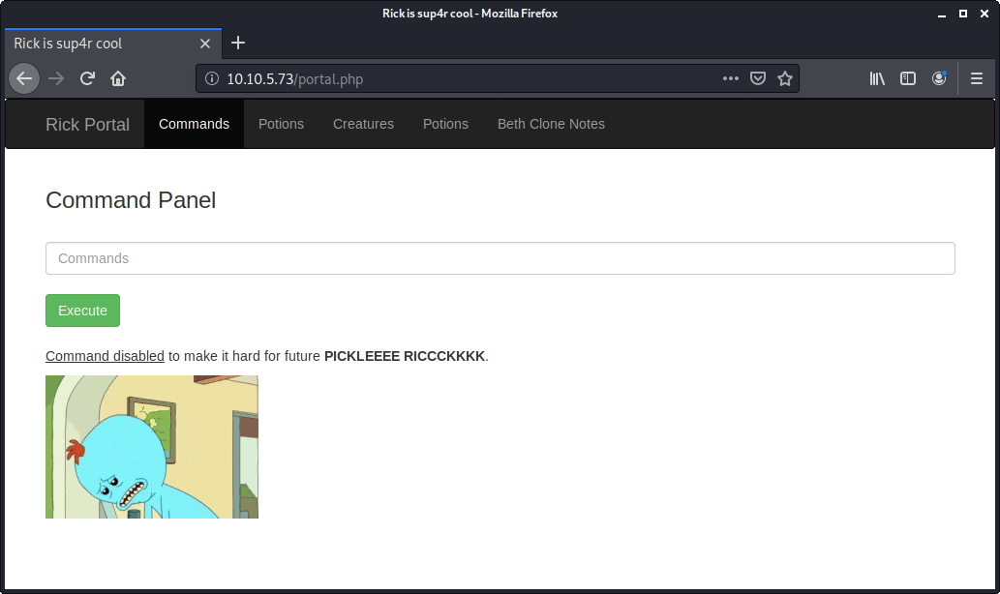
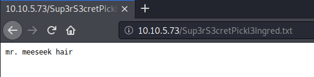
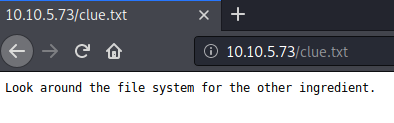
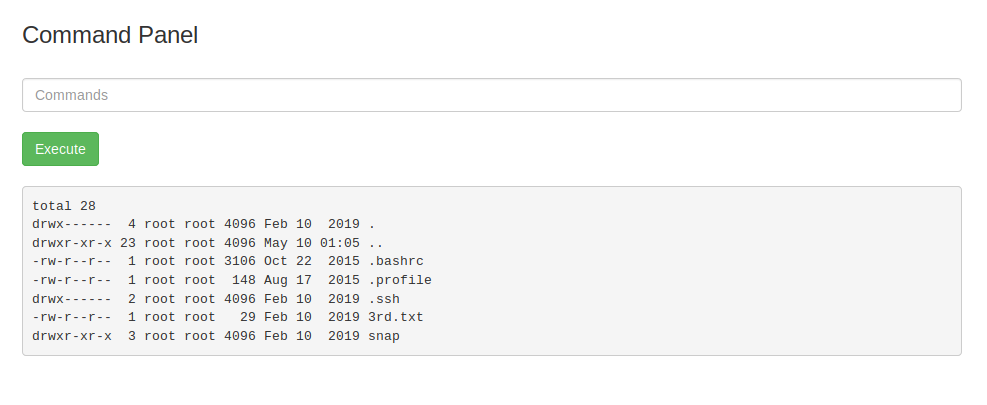

# Pickle Rick

> Nashia Holloway | May 9th, 2020

There are 3 flags (ingredients) that need to be found in order for Rick to become human again.

## Enumeration

Only SSH and port 80 are open.



In the page source, there's a comment giving us the username. Maybe this is for ssh, or maybe there's a login page somewhere. 



`username:R1ckRul3s`

Nothing came of the gobuster search, so we may have to bruteforce ssh with hydra. That didn't work.

Let's add file extensions to our gobuster search (I should really be doing this by deafult).

```
gobuster dir -u http://10.10.5.73 -w /usr/share/wordlists/dirb/common.txt -x .php
```
This gives us more results. I knew there had to be, because there are more pictures in the `/assets` directory.



> This shows the difference between the two gobuster results (failed ssh attempt in the middle).

`login.php` and `portal.php` are the new additions. (portal.php redirects to login.php).



When poking around the webiste, there was a famous Rick saying in the robots.txt file, that I didn't think anything about until now. But when trying it out as the password, it works!



We're immediately greeted with a command panel. Let's try some commands. `ls` returns:



Trying to cat `Sup3rS3cretPickl3Ingred.txt`, we get an error gif.



Hmmm... if we can't cat, what can we do? I see `robots.txt` in the listing, and I know we're able to navigate to it to see its contents. We can do the same with Sup3rS3cretPickl3Ingred.txt and we get our first ingredient!



Let's get that clue too.



```
sudo -l
```
www-data has sudo privs. Interesting. Let's see what other users are here with `ls -la /home`. There is a rick user. The second ingredient is there, but we can't put this in the URL to view it. Looking up alternatives to `cat`, there is the `less` command that does the trick and isn't blocked.

```
less '/home/rick/second ingredient'
```
And with that, we have the second ingredient: `1 jerry tear`.

I bet the last ingredient is in the root directory. And since we know we have sudo privileges, we can get this flag easy.

```
sudo la -la /root
```

To see what it's called.



```
sudo less /root/3rd.txt
```
