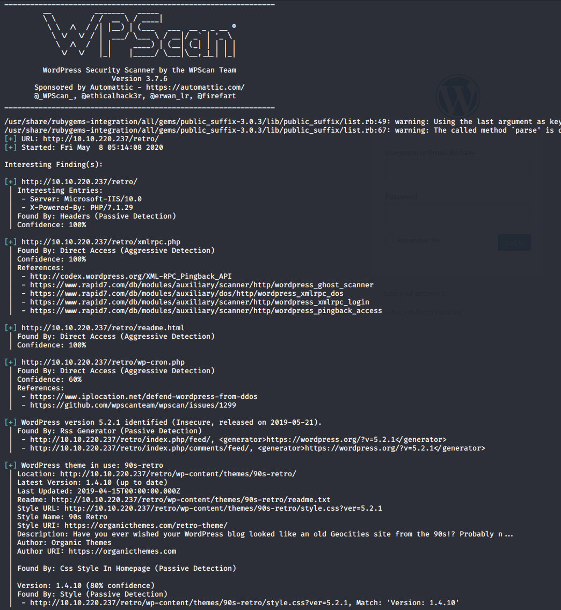
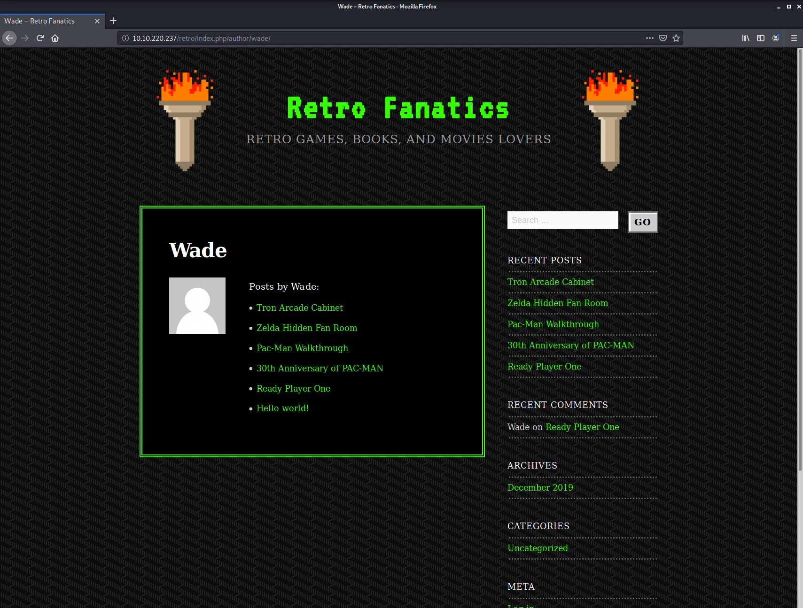
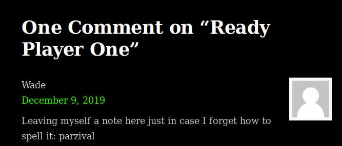
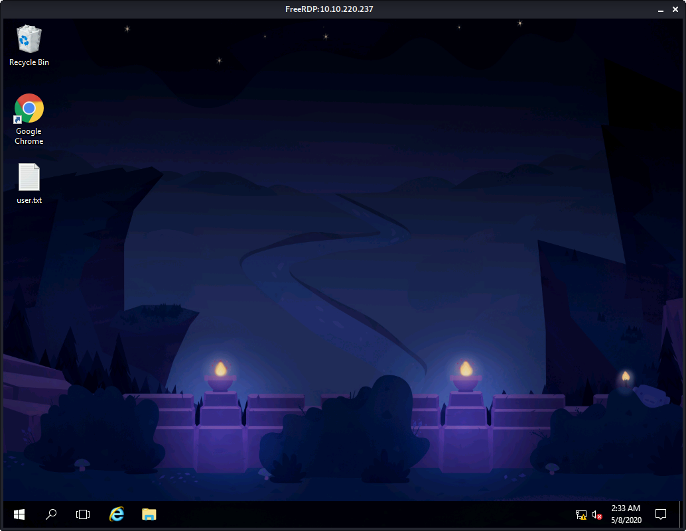
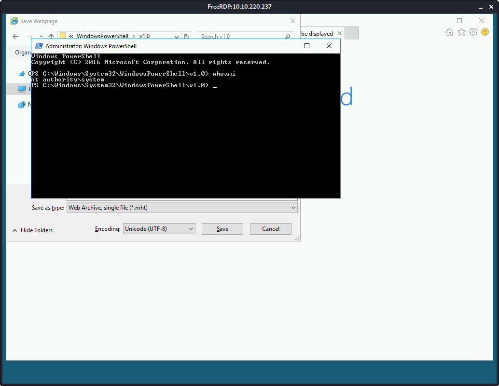

# Retro

> Nashia Holloway | May 8th, 2020

## Task 1 Pwn

**1. A web server is running on the target. What is the hidden directory the website lives on?**

Port 80 and 3389 are open. Running a gobuster search on the web server: `gobuster dir -u http://10.10.220.237 -w /usr/share/wordlists/dirbuster/directory-list-2.3-medium.txt`. There is a hidden directory.

A more tailored gobuster search reveals the site is a wordpress site.

`wpscan --url http://$IP/retro` shows there are a few vulnerabilities.

The `5.2.1` version has an exploit, but I couldn't figure out how to use it. There's also a `Password Login Scanner` through metasploit, but I think it needs creds to work. And if we have creds, we could just login at that point, haha.

Refocusing, going to poke around the website some more.

Here is the creator's page. He left a comment on a post that looks like it could be a password (you can do that when the only one who reads your blog is you #experience).

Let's see if it'll work with an RDP session. `xfreerdp /u:'retroweb\wade' /v:$IP` It does! And the user flag is on the desktop.

I tried uploading a php reverse shell, but couldn't get a connection (assuming because of firewall?). Tried more common ports to no avail.

Poking around the RDP session, there's an interesting page bookmarked in the browser. The NIST page for `CVE-2019-1388`. An elevation of privilege vuln in the Windows Certificate Dialog. I followed a [video](https://www.youtube.com/watch?v=3BQKpPNlTSo) by the Zero Day Initiative to exploit.

 
