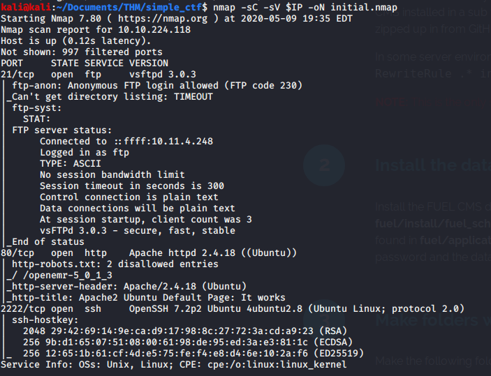
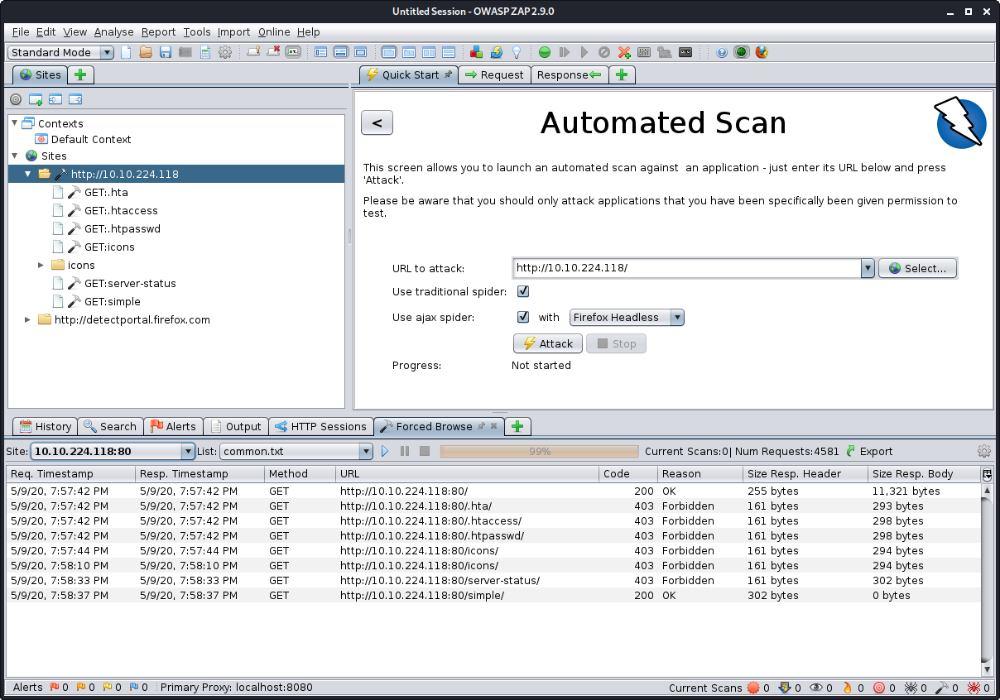
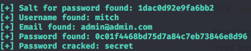
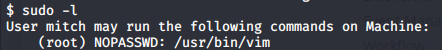

# Simple CTF

> Nashia Holloway | May 9th, 2020

**How many services are running under port 1000?**


 	
Looks like FTP allows anonymous logons, there's an Apache web server running, and SSH is open on port 2222.

**What's the CVE you're using against the application?**

Logging into FTP anonymously, there's a text file in the `pub` directory called `ForMitch.txt`. 

```
Dammit man... you'te the worst dev i've seen. You set the same pass for the system user, and the password is so weak... i cracked it in seconds. Gosh... what a mess!
```

Here we have some clues. A user named "Mitch", who is a web developer (a crappy one), who uses the same weak password for the system user. Great.

Let's try out my new skills with OWASP ZAP to enumerate directories on the web server. 



There's a directory called "simple" we can get to.


They're runnin version 2.2.8 of the "CMS Made Simple" application. There are a lot of exploits available, but we're going to use the SQLi one from 2019 (CVE-2019-9053).	

**What's the password?**

```
python /usr/share/exploitdb/exploits/php/webapps/46635.py -u http://10.10.224.118/simple -w /usr/share/wordlists/rockyou.txt -c
```

	

**Where can you login with the details obtained?**

We can login with ssh with the username Mitch we found and this password.

```
ssh mitch@10.10.224.118 -p 2222
```

**What's the root flag?**



Mitch can run vim with sudo privs. 

```
sudo vim
```

Once inside vim, `:!sh` to get a root shell! Get that flag, girl!
