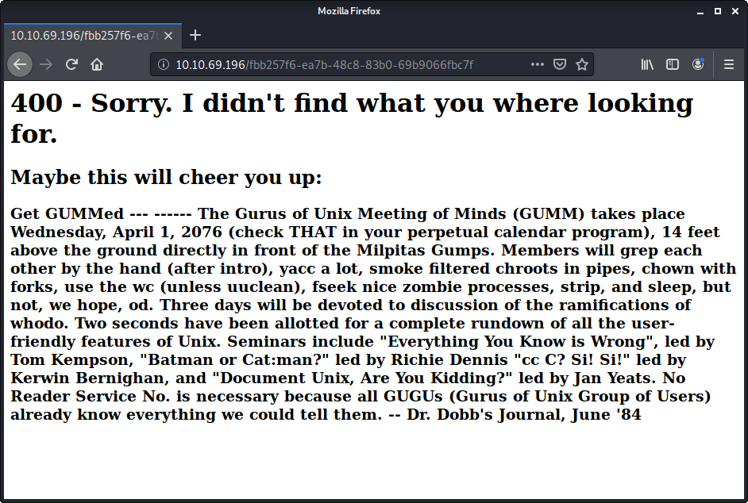
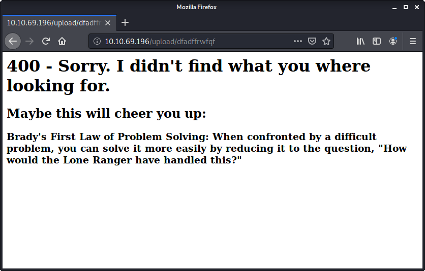

# Tempus Fugit Durius

> Nashia Holloway | May 9th, 2020

## Recon

Nmap shows ports 22, 111, and 80 open.

Shows there is an FTP server running (didn't show up on nmap?? hmmm).

This reads like a riddle. There are a few linux commands throughout.. maybe clues?

There is an upload page! huzzah!

It's hard to run gobuster because everythin in the wordlist comes back as status 200, and when navigating to the "page", there's a random quote.

**EXAMPLES**

More accurately, everytime the page is refreshed, regardless of the directory, there's a new quote. Interesting that the code in the top is 400 (HTTP status code for Bad Request). Or maybe there are 400 quotes, because the actual status code is 200?

When uploading a random text file, there's a 302 status (Found; previouslt "Moved Temporarily"), which tells the client to browse to another URL. I need to figure out where these uploads are going.

Tried uploading a shell script, and received a warning that only txt and rtf files are allowed to be uploaded.

Tried uploading a netcat reverse shell commanf in a file named `up.sh.txt` and make a curl request that refreshes the page 400 times with `curl http://$IP/upload/1[1-401], resulting in 400 differnt quotes, hoping to find the page where the shell dropped so I can navigate to it...

Research shows that the `.htaccess` file hold the config for redirects. Maybe I can find it.

I also ran another nmap scan for all ports and discovered port 44955 open (RPC). Nevermind... just a statd RPC service to implement lock recovery when the server crashes and reboots.
